<!-- HERO -->

  

<!-- ABOUT -->

  

## Currently Learning

- Java and Object-Oriented Programming
- Data Structures & Algorithms
- Coding Problem Solving & Algorithms
- Computer Networking
- Cybersecurity

## What I'm Working Toward

I'm building a strong foundation in software engineering, cybersecurity and networking, with the goal of applying these skills through internships, placement opportunities and future graduate roles in technology.

---

<!-- STACK -->

  

## Featured Projects

### 💰 Budget Tracker
A Python and SQL application for tracking and analysing personal finances.

### 🎮 2D Endless Runner
A Python-based 2D endless runner featuring user authentication, animated gameplay, obstacles, scoring and a leaderboard.

### 🔐 Security Projects
A collection of projects exploring password security, encryption and cybersecurity concepts.

*More projects will be added as I continue developing my portfolio.*

---

## Education

**BSc (Hons) Computer Science**  
Manchester Metropolitan University

**A Levels**  
Mathematics • Physics • Computer Science

## Certifications & Technical Learning

- **CIISec CyberEPQ — A***
- **CompTIA A+ Core 1 — Course Content Completed**
- **CompTIA Network+ — Expected Completion: January 2027**

---

## Connect With Me

- GitHub: [github.com/ashar-khalid07](https://github.com/ashar-khalid07)
- LinkedIn: [Coming soon]
- Portfolio: [asharkhalid.co.uk](https://asharkhalid.co.uk)

---

<!-- GITHUB ACTIVITY -->

  

